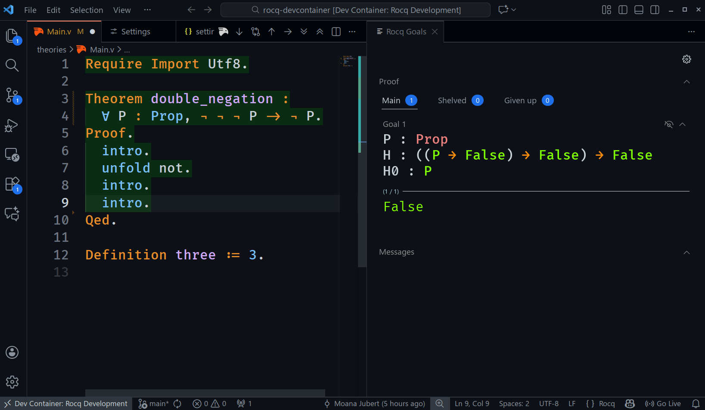

# [🏗️ Rocq Devcontainer Template](https://github.com/mjub/rocq-devcontainer)

[](https://vscode.dev/redirect?url=vscode://ms-vscode-remote.remote-containers/cloneInVolume?url=https://github.com/mjub/rocq-devcontainer)


[](https://github.com/mjub/rocq-devcontainer/actions/workflows/build.yml)

A **zero-configuration** development environment for [Rocq](https://rocq-prover.org/) (formerly Coq) theorem proving.

Getting a working Rocq setup can be surprisingly frustrating. Version mismatches between Rocq, OCaml, the `vsrocq` language server, and the VSRocq extension are common and often break silently. This template eliminates that pain by **pinning all versions** to a known-working configuration. Open the project, and you're ready to prove.

**Who is this for?** Students, researchers, or developers exploring formal verification who want to start proving theorems immediately, without spending hours debugging toolchain issues.



---

## 📦 Installation

### 1. Create Your Repository

This is a **template repository**. You can create your own copy instantly:

[](https://github.com/mjub/rocq-devcontainer/generate)

> 💡 If you want automatic documentation deployment, enable **GitHub Pages** in your new repository:
> - Go to **Settings → Pages**
> - Under **Build and deployment**, set **Source** to **GitHub Actions**

### 2. Clone Locally

```bash
git clone https://github.com/<your-username>/<your-repo>.git
cd <your-repo>
```

### 3. Open in VS Code with Devcontainers

1. Install [Docker](https://www.docker.com/) and the [Dev Containers](https://marketplace.visualstudio.com/items?itemName=ms-vscode-remote.remote-containers) extension for VS Code.
2. Open the cloned folder in VS Code.
3. When prompted, click **"Reopen in Container"** (or run `Dev Containers: Reopen in Container` from the Command Palette).

The container builds automatically with Rocq, the language server, and all extensions pre-configured. ☕ First build takes a few minutes.

---

## 🚀 Usage

### Interactive Proving

1. Create a new `.v` file in `theories/` (e.g., `theories/MyProof.v`)
2. Write your Rocq code
3. Use <kbd>Alt</kbd> + <kbd>→</kbd> to step the interpreter forward to the current line
4. Use <kbd>Alt</kbd> + <kbd>↑</kbd> to step backward

### Building & Documentation

| Command | Description |
|---------|-------------|
| `make all` | Compile all `.v` files and generate documentation |
| `make rocq-html` | Generate HTML documentation only (in `html/`) |
| `make clean` | Remove all build artifacts |

**VS Code Tasks** are also available (<kbd>Ctrl</kbd>+<kbd>Shift</kbd>+<kbd>B</kbd> for default build):
- `Build all`: runs `make all`
- `Build documentation`: runs `make rocq-html`
- `Clean`: runs `make clean`

### Live Documentation Preview

The [Live Server](https://marketplace.visualstudio.com/items?itemName=ritwickdey.LiveServer) extension is pre-installed.

1. Click **"Go Live"** in the VS Code status bar (bottom-right)
2. Open [http://localhost:31517](http://localhost:31517)
3. The page auto-refreshes whenever you rebuild documentation! 🔄

### Continuous Integration

Every push to `main` that modifies a `.v` file triggers a GitHub Actions workflow that:
1. ✅ Validates all proofs by building the project
2. 📄 Generates HTML documentation
3. 🌐 Deploys to GitHub Pages at `https://<username>.github.io/<repository>/` (typically < 2 mins ⚡)

---

## ⚙️ Configuration

### Change Library Name

Edit `_CoqProject` to rename your library:

```diff
- -R theories Hello
+ -R theories MyLibrary
```

### Update Rocq/OCaml Version

Both files **must be updated together** with the same image tag:

1. In `.devcontainer/devcontainer.json`, update:
   ```json
   "ROCQ_VERSION": "9.0.1-native-ocaml-4.14.2-flambda"
   ```

2. In `.github/workflows/build.yml`, update:
   ```yaml
   image: rocq/rocq-prover:9.0.1-native-ocaml-4.14.2-flambda
   ```

Available tags: [rocq/rocq-prover on Docker Hub](https://hub.docker.com/r/rocq/rocq-prover/tags)

### Update VSRocq Version

Due to devcontainer spec limitations, you must update **two places** in `.devcontainer/devcontainer.json`:

```json
"args": {
    "VSROCQ_VERSION": "2.3.1"  // ← Here
},
// ...
"extensions": [
    "rocq-prover.vsrocq@2.3.1"  // ← And here
]
```

---

## 🔧 Troubleshooting

| Issue | Solution |
|-------|----------|
| Container won't build | Ensure Docker is running with at least 4GB RAM allocated |
| VSRocq not responding | Reload the window: <kbd>Ctrl</kbd>+<kbd>Shift</kbd>+<kbd>P</kbd> → `Developer: Reload Window` |
| Proof checking slow | The first build compiles dependencies; subsequent runs are faster |

---

Built with 🧡 for the Rocq community.
